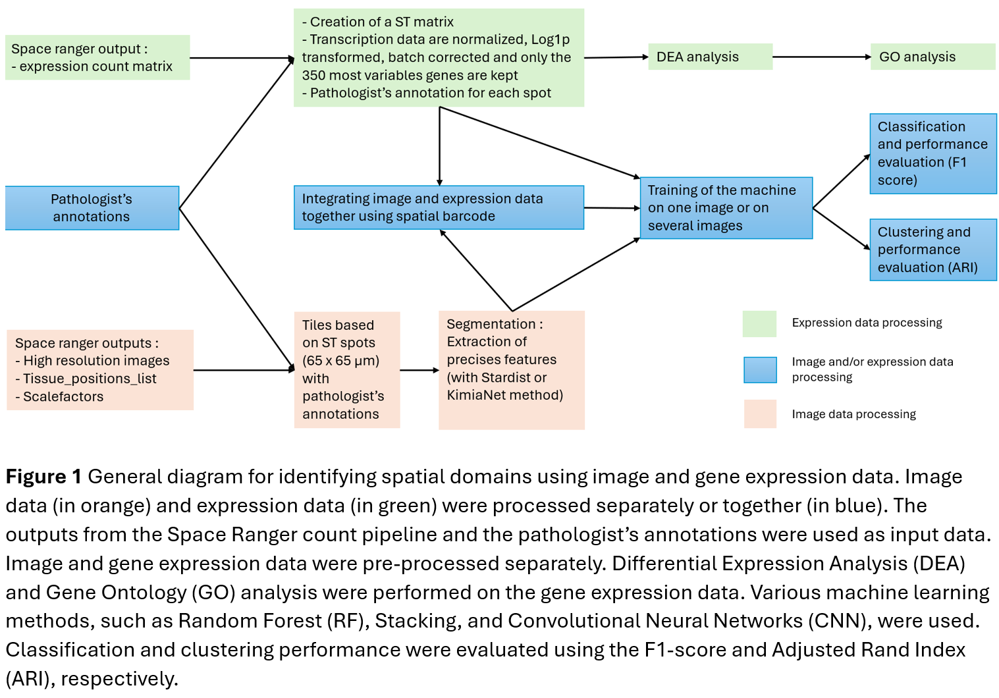

# Corentin_Internship

## Integration of histopathological image data and expression data from Spatial Transcriptomics to identify tissues within breast cancer sections

## Description
Analysis of Gene Expression Profiles in Histological Tissue Sections is a cornerstone in biological research and diagnostics. In this study, an innovative technique, spatial transcriptomics, is used to analyze gene expression profiles at a specific time and location within sections of cancerous breast tissue. The goal is to analyze and detect, using these data, the cancerous, benign, stromal, immune, and adipose tissues present in a breast tissue section. The data generated by spatial transcriptomics come in two forms: spatial gene expression data and histopathological image data, which provide information about tumor morphology. These data will be processed using Machine Learning tools with the aim of training a model capable of detecting the different tissue types, including cancerous ones. This work presents the performance of various models: models trained solely on spatial gene expression data, models trained solely on histopathological image data, and finally, models trained on combined spatial gene expression and histopathological image data. A differential expression analysis was also conducted to characterize expression profiles specific to each tissue type present in the breast sections.

## General diagram of the project

## Internship report
The Internship report is available on the GitLab page and contains the most valuable results of the study.

## Installation
The code was written in python. If you want to launch it, multiple python modules are needed:  
torch 1.7.1,
sklearn,
scanpy,
anndata,
tensorflow,
PIL,
cv2,
pandas,
numpy,
CUDA Version 10.2.89,
mclust 

## Support
If you have any questions, please contact me by mail: corentin.meyvaert@outlook.fr

## Contributing
This code is open for any Contribution.

## Authors and acknowledgment
I would like to express my gratitude to Pr. Carsten Daub and to all the member of the Daub Lab.

## License
Everyone can use, modify and copy this code as they want. For the ConGI directory, most of the code is not mine and follow these rules : 

Permission is hereby granted, free of charge, to any person obtaining a copy
of this software and associated documentation files (the "Software"), to deal
in the Software without restriction, including without limitation the rights
to use, copy, modify, merge, publish, distribute, sublicense, and/or sell
copies of the Software, and to permit persons to whom the Software is
furnished to do so, subject to the following conditions:

The above copyright notice and this permission notice shall be included in all
copies or substantial portions of the Software.

THE SOFTWARE IS PROVIDED "AS IS", WITHOUT WARRANTY OF ANY KIND, EXPRESS OR
IMPLIED, INCLUDING BUT NOT LIMITED TO THE WARRANTIES OF MERCHANTABILITY,
FITNESS FOR A PARTICULAR PURPOSE AND NONINFRINGEMENT. IN NO EVENT SHALL THE
AUTHORS OR COPYRIGHT HOLDERS BE LIABLE FOR ANY CLAIM, DAMAGES OR OTHER
LIABILITY, WHETHER IN AN ACTION OF CONTRACT, TORT OR OTHERWISE, ARISING FROM,
OUT OF OR IN CONNECTION WITH THE SOFTWARE OR THE USE OR OTHER DEALINGS IN THE
SOFTWARE.

## Project status
My Internship is finished and the code will not be updated.
